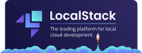
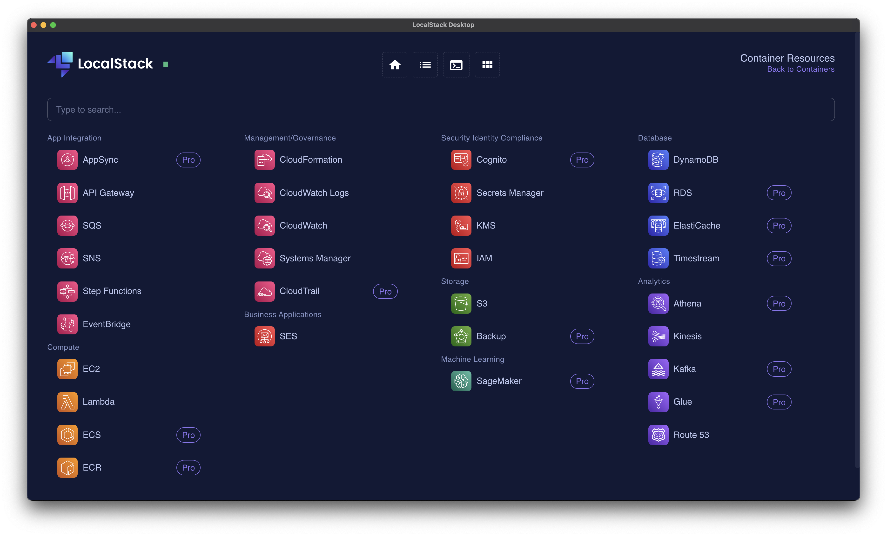

    

# Embracing the Power of LocalStack for AWS Emulation: Transform Your DevOps Journey 🚀

## Unveiling LocalStack - Your Local AWS Environment

In the dynamic world of software development, simulating cloud services locally is a game-changer. That's where [**LocalStack**](https://www.localstack.cloud/) comes in! 🌟 LocalStack provides an easy-to-use, efficient, and cost-effective way to emulate AWS services on your local machine. This incredible tool bridges the gap between development and production, ensuring a seamless transition of your applications to the cloud.

### Why Choose LocalStack? 🤔

- **Cost-Effective:** Say goodbye to unexpected AWS bills! Test extensively without incurring extra costs.
- **Development Agility:** Rapid prototyping and testing without the latency of an actual cloud environment.
- **Consistency:** Ensure your applications behave the same way in development as they do in production.
- **Offline Development:** Internet down? No problem! Keep coding with LocalStack's offline capabilities.

## Highlighting Our LocalStack Examples

We've curated a set of practical examples to jumpstart your LocalStack experience.

### LocalStack using Docker and Docker Compose 🐳

- **What's Inside:** A Dockerfile and compose.yml to spin up LocalStack with essential services like DynamoDB, S3, SQS, and Kinesis.
- **Perfect For:** Developers looking for a quick setup with Docker to emulate AWS services.
- **Check it Out:** [LocalStack Docker Example](https://github.com/nanlabs/devops-reference/tree/main/examples/compose-localstack/)

### Serverless SQS Offline + Python + LocalStack 🐍

- **What's Inside:** A Serverless Framework example with LocalStack to run Lambda functions and SQS locally.
- **Perfect For:** Python developers keen on serverless architecture, without leaving their local environment.
- **Check it Out:** [Serverless SQS Python Example](https://github.com/nanlabs/devops-reference/tree/main/examples/serverless-sqs-python/)

### Serverless LocalStack with S3 and DynamoDB 📦

- **What's Inside:** A Serverless Framework setup to run Lambda functions with S3 and DynamoDB using LocalStack.
- **Perfect For:** Teams focusing on integrating S3 and DynamoDB in their serverless applications.
- **Check it Out:** [Serverless LocalStack S3 & DynamoDB Example](https://github.com/nanlabs/devops-reference/tree/main/examples/serverless-localstack-with-s3-and-dynamodb/)

## LocalStack in Different Scenarios

LocalStack's versatility shines across various use cases:

- **Local Development:** Mimic AWS in your development environment for faster feedback and iteration.
- **Continuous Integration (CI):** Integrate LocalStack into your CI pipeline for thorough pre-deployment testing.
- **Local Deployment:** Test your AWS-dependent applications in a contained, controlled environment before going live.

## Making it even easier with LocalStack Desktop 🖥️

[LocalStack Desktop](https://docs.localstack.cloud/user-guide/tools/localstack-desktop/) is a GUI application that makes it even easier to use LocalStack. It's available for Windows, macOS, and Linux, and it's free to use! 🎉

## Wrapping Up

LocalStack is more than just a tool; it's a catalyst for efficient, effective, and economical cloud application development. Whether you're a solo developer or part of a large team, LocalStack fits right into your workflow, ensuring that your cloud applications are robust, reliable, and ready for the real world.

Happy coding, and may your cloud journey be as seamless as it is exciting! ☁️🚀
