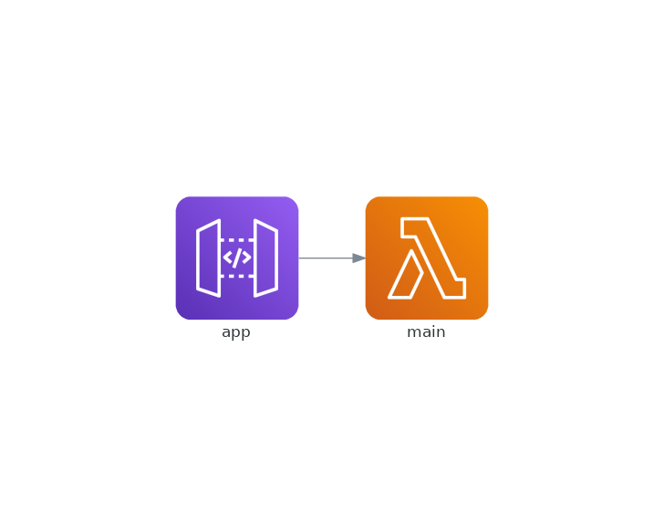

# Simple Klotho app

## Install Klotho

### In linux

Run

```bash
curl -fsSL "http://srv.klo.dev/update/latest/linux/x86_64?stream=pro:latest" -o klotho
```

And then:

```bash
sudo chmod +x klotho
```

Finally add Klotho to Path:

```bash
PATH=$PATH:~/klotho
```

This is because I've downloaded Klotho in my root user folder.

### In other OS

Check the documentation: [LINK HERE](https://klo.dev/docs/download-klotho)

## Run Server

```bash
go run main.go
```

```bash
curl "localhost:3000/hello"
# -> Hello from Klotho!

curl "localhost:3000/hello/your-name"
# -> Hello your-name!
```

## Compile with Klotho

### Login with the Klotho's cli

If you haven't already login, run the following command:

```bash
klotho --login
```

### Get the cloud native version of the application

E.G.

```bash
klotho . --app my-first-app --provider aws --outDir _compiled
```

This will generate `/_compiled` directory

### Visualize the cloud version

Open the `./_compiled/my-first-app.png` diagram created alongside the cloud application:


