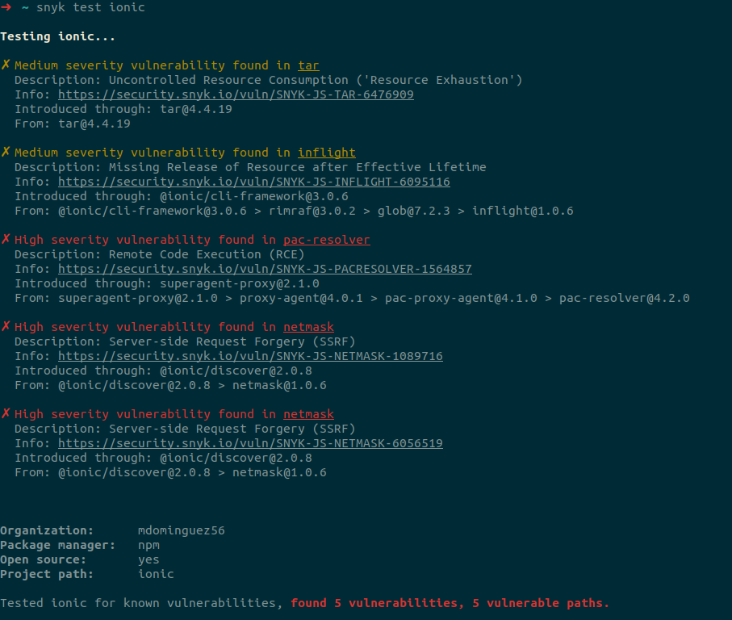

# Code Scanning Guide 🚀

## Overview

The objective of this section is to show some of the main options to perform different types of scans to help improve the security of our applications.

## Filesystem Scan 🖥️

This section covers various ways to perform scans directly on your source code.

## Snyk 🔍

The Snyk CLI integrates with your development workflow to scan for vulnerabilities in code, dependencies, and container images. It supports various languages including JavaScript, TypeScript, Python, Go, and Java.



### Installation

1. **Install Snyk CLI**: Follow the [installation guide](https://docs.snyk.io/snyk-cli/install-or-update-the-snyk-cli).
2. **Authenticate**: Use the [authentication guide](https://docs.snyk.io/snyk-cli/authenticate-the-cli-with-your-account).

### Test Your Installation 🧪

After authenticating, you can test your installation. For a quick test, run `snyk --help`. Alternatively, you can perform a quick test on a public npm package, for example `snyk test ionic`.

### Scan Your Project 🛡️

Before using the Snyk CLI to test your Open Source Project for vulnerabilities, with limited exceptions, you must build your Project. For details, see Open Source Projects that must be built before testing.

Depending on the language of your open-source Project, you may need to set up your language environment before using the Snyk CLI. For details, refer to Supported languages, frameworks, and feature availability overview.

After you have installed the CLI and authenticated your machine, to scan an open-source Project, use `cd /my/project/` to change the current directory to a folder containing a supported package manifest file, such as `package.json`, `pom.xml`, or `composer.lock`. Then run `snyk test`. All vulnerabilities identified are listed, including their path and fix guidance.

To scan your source code, run `snyk code test`. More information [here](https://docs.snyk.io/snyk-cli/scan-and-maintain-projects-using-the-cli/snyk-cli-for-open-source).

You can scan a Docker image by its tag running, for example: `snyk container test ubuntu:18.04`. More information [here](https://docs.snyk.io/snyk-cli/commands/container).

### Monitor Your Open Source or Container Project 📈

Snyk can monitor your Open Source or Container integrated SCM Project periodically and alert you to new vulnerabilities. To set up your Project to be monitored, run `snyk monitor` or `snyk container monitor`.

This creates a snapshot of your current dependencies so Snyk can regularly scan your code. Snyk can then alert you about newly disclosed vulnerabilities as they are introduced or when a previously unavailable patch or upgrade path is created. The following code shows an example of the output of the `snyk monitor` command.

You can log in to your Snyk account and navigate to the [Projects page](https://app.snyk.io/projects?_gl=1*18cfs1o*_ga*MjA0MzE3ODY5Mi4xNzA4NjIzNzk4*_ga_X9SH3KP7B4*MTcxMTQ3NTk5OC40LjEuMTcxMTQ3NjkzNy4wLjAuMA..) to find the latest snapshot and scan results:


## Infrastructure as Code (IaC) 🏗️

All the information in this section was obtained from this [documentation](https://docs.snyk.io/scan-with-snyk/snyk-iac/scan-your-iac-source-code).

## Snyk + Terraform 🌍

Snyk currently scans Terraform (`.tf`) files when they are imported from an integrated Git repository. You can scan a Terraform module repository by importing the repo that holds the module from an SCM or by scanning the directory itself using the `snyk iac test` CLI command.

Scanning Terraform files gives you security feedback on everything that is statically configured in the module. To benefit from recurring and scheduled testing, follow best practices and import custom modules directly from an SCM.

### Prerequisites

- You must be an administrator for the Organization you are configuring in Snyk.
- Ensure you have already integrated your Git repository.

#### Configure Snyk to Scan Terraform Files

- Log in to your account and navigate to the relevant Group and Organization that you want to manage. Integrations are managed per Organization.
- Toggle the setting to enable Snyk to detect Infrastructure as code files as shown:


- If needed, review and adjust the Infrastructure as code Severity settings on the AWS tab in the example. Check to select the file types to scan, CloudFormation, Terraform, or both, and from the pulldown selection, choose the severity level for each API Gateway.


## Trivy 🔎

Trivy is a comprehensive and easy-to-use open-source vulnerability scanner for container images, file systems, and Git repositories.

### Installation

To install Trivy, follow the [installation guide](https://aquasecurity.github.io/trivy/v0.53/getting-started/installation/).

### Scan Your Project

To scan your file system, you can run the following command:

```sh
trivy fs /path/to/your/project
```

### Advanced Example with SARIF Upload

To upload Trivy scan results to GitHub Security:

```sh
trivy fs /path/to/your/project --format sarif --output trivy-results.sarif
```

### Monitor Your Project

To continuously monitor your project, run:

```sh
trivy fs /path/to/your/project --format json --output trivy-results.json
```

You can set up a cron job or integrate this command into your pipeline for regular monitoring.

## Running Trivy Locally

To scan a Docker image with Trivy:

```sh
trivy image ubuntu:18.04
```

For advanced usage, Trivy can scan for misconfigurations, secrets, and vulnerabilities in infrastructure as code files. Here are a few examples:

### Scan Docker Images

```sh
trivy image --severity CRITICAL --exit-code 1 ubuntu:18.04
```

### Scan File System

```sh
trivy fs --severity HIGH,CRITICAL --exit-code 1 /path/to/your/project
```

### Scan Infrastructure as Code (IaC) Files

```sh
trivy config --severity HIGH,CRITICAL /path/to/your/iac
```

## Super Linter 🛠️

Super Linter helps validate your source code with a collection of linters. It supports various languages and provides a way to maintain a consistent codebase.

### Installation

Super Linter can be easily integrated into your workflow. Check the [official GitHub repository](https://github.com/github/super-linter) for installation instructions.

### Running Super Linter Locally with Docker

To run Super Linter locally, you can use Docker:

```sh
docker run -e RUN_LOCAL=true -v $(pwd):/tmp/lint github/super-linter
```

This command mounts your current directory to the `/tmp/lint` directory inside the container and runs the linter against it.

### Advanced Configuration

You can customize the Super Linter configuration by creating a `.super-linter.env` file in your project directory. Here is an example:

```sh
# .super-linter.env
VALIDATE_JS=true
VALIDATE_PYTHON=true
VALIDATE_MARKDOWN=true
```

Then, run the Docker command with the environment file:

```sh
docker run --env-file .super-linter.env -v $(pwd):/tmp/lint github/super-linter
```

## Mega Linter 🚀

Mega Linter is an advanced linter tool that supports more capabilities and better performance compared to Super Linter.

### Installation

Check the [official Mega Linter documentation](https://nvuillam.github.io/mega-linter/) for installation instructions.

### Running Mega Linter Locally with Docker

To run Mega Linter locally, you can use Docker:

```sh
docker run -e ENABLE=JS,MD -v $(pwd):/tmp/lint nvuillam/mega-linter:latest
```

## Best Practices 🌟

1. **Least Privilege Principle**: Grant the minimal permissions required for the tools to operate.
2. **Regular Updates**: Keep your tools and dependencies up to date to benefit from the latest security patches and features.
3. **Fail Fast**: Configure your workflows to fail the build upon detecting critical vulnerabilities.
4. **Monitor and Alert**: Set up alerts for new vulnerabilities and monitor your dashboards regularly.

By following these guidelines and using the provided examples, you'll maintain a secure and robust pipeline. Happy coding! 🚀
