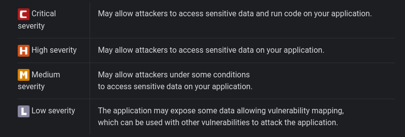
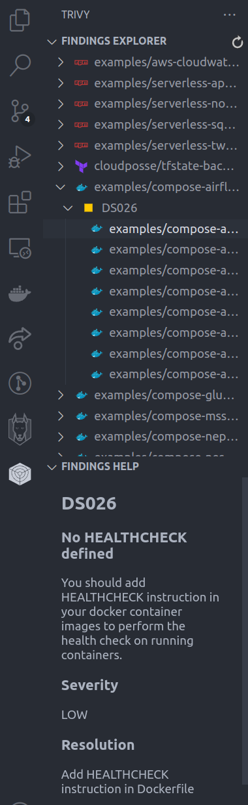

# Early Stages of Development Workflow 🚀

It is essential to implement security measures in the early stages of development to prevent vulnerabilities from being introduced into your codebase. This guide provides a compilation of various tools that can be implemented in the early stages of development to enhance the security of your web projects. By integrating these tools early, you can "shift left" 🡪, detecting and resolving security issues sooner in the development lifecycle.

## Overview

In this document, we will explore the following topics:

1. How to integrate existing tools with IDEs such as Visual Studio Code and IntelliJ.
2. How to implement security scans in your Git workflow using pre-commit and pre-push hooks.
3. Linter configurations to maintain code quality and security.

## IDE Integrations

In this section, you will find a guide on how to implement tools like Snyk or Trivy in the IDE you are using. The goal is to have a powerful tool that allows you to perform scans on your code and detect important security-related points in the early stages of development.

### Visual Studio Code

#### Snyk

Follow the steps below to install Snyk in Visual Studio Code:

1. Visit the [Snyk Visual Studio Code Extension Documentation](https://docs.snyk.io/integrate-with-snyk/ide-tools/visual-studio-code-extension).
2. Install the extension and configure it as necessary.

Example of how you will see Snyk in Visual Studio Code:


Once you have installed the extension and made the required configurations, you can scan the repository you are working on. The analyses you can perform include:

- **Open Source Security:** This scan primarily focuses on your dependencies and devDependencies. If vulnerabilities are found, they will be indicated using notations such as CVE, CWE, CVSS, etc. Recommended actions for such scans usually involve updating dependencies to newer versions.
- **Code Security:** This scan assesses the security of your code, detecting potential issues such as XSS attacks, SQL injections, detection of hardcoded secrets, etc.
- **Configuration Issues:** This section analyzes various configurations of your application, such as `.yml` files, cloud environment configurations, etc.
- **Code Quality:** This analysis is related to the quality of your code, providing recommendations for code formatting, implementation of best practices, etc.

All the above-mentioned scans will give results according to the level of criticality, which may have different severities:



If you want to learn more about analyzing the results obtained, you can check this [link](https://docs.snyk.io/integrate-with-snyk/ide-tools/visual-studio-code-extension/view-analysis-results-from-visual-studio-code-extension).

Snyk will run an analysis each time you start Visual Studio Code, and you have the option to perform a rescan whenever needed.

#### Trivy

Here, you can find the documentation for installing Trivy in Visual Studio Code: [Trivy VSCode Extension](https://github.com/aquasecurity/trivy-vscode-extension).

Trivy performs a scan on your entire code, providing results aimed at preventing the following types of vulnerabilities:

- **Code vulnerabilities:** Prevent DDOS, SQL Injection, XSS attacks, etc.
- **Infra vulnerabilities:** Analyzes Infrastructure as Code (AWS, Azure, Terraform, etc.) and provides recommendations to avoid security flaws, such as incorrect implementation of Secrets Manager, preventing the use of hardcoded keys, etc.
- **Container analysis:** Provides results on the analysis of containers (Dockerfiles, docker-compose). Some possible results include prevention of using the root user, no HEALTHCHECK defined, etc.

Here's how you'll see the results obtained in each scan:



### JetBrains

#### Snyk

For JetBrains IDEs, follow the steps below to install Snyk:

1. Visit the [Snyk JetBrains Plugin Documentation](https://docs.snyk.io/integrate-with-snyk/ide-tools/jetbrains-ide-extension).
2. Install the plugin and configure it according to your project needs.

#### Trivy

Currently, there is no official Trivy plugin for JetBrains IDEs. However, you can run Trivy scans via terminal within the IDE.

## Git Workflow

In this section, we will mention tools that will allow us to perform different types of scans in our git workflow. This way, even in the early stages of our development process, we will be able to detect vulnerabilities and fix them.

### Using Pre-commit

#### Snyk with Pre-commit

To use Snyk with pre-commit hooks in a Python project, follow these steps:

1. Install pre-commit and Snyk:

   ```sh
   pip install pre-commit
   npm install -g snyk
   ```

2. Create a `.pre-commit-config.yaml` file in your project root:

   ```yaml
   repos:
     - repo: https://github.com/snyk-omar/snyk-pre-commit-hook
       rev: main
       hooks:
         - id: snyk-test
   ```

3. Install the pre-commit hook:

   ```sh
   pre-commit install
   ```

Now, every time you commit, Snyk will run and scan your project for vulnerabilities.

#### Trivy with Pre-commit

To use Trivy with pre-commit hooks:

1. Install pre-commit and Trivy:

   ```sh
   pip install pre-commit
   brew install aquasecurity/trivy/trivy
   ```

2. Create a `.pre-commit-config.yaml` file in your project root:

   ```yaml
   repos:
     - repo: https://github.com/fabasoad/pre-commit-trivy
       rev: main
       hooks:
         - id: trivy-scan
           args: ["--exit-code", "1"]
   ```

3. Install the pre-commit hook:

   ```sh
   pre-commit install
   ```

Now, every time you commit, Trivy will scan your project for vulnerabilities.

#### Super Linter with Pre-commit

To use Super Linter with pre-commit hooks:

1. Install pre-commit:

   ```sh
   pip install pre-commit
   ```

2. Create a `.pre-commit-config.yaml` file in your project root:

   ```yaml
   repos:
     - repo: https://github.com/github/super-linter
       rev: main
       hooks:
         - id: super-linter
           name: Run Super Linter
           entry: docker run --rm -v $(pwd):/tmp/lint github/super-linter
           language: docker
           files: .*
   ```

3. Install the pre-commit hook:

   ```sh
   pre-commit install
   ```

Now, every time you commit, Super Linter will run and lint your project.

#### Mega Linter with Pre-commit

To use Mega Linter with pre-commit hooks:

1. Install pre-commit and Docker:

   ```sh
   pip install pre-commit
   ```

2. Create a `.pre-commit-config.yaml` file in your project root:

   ```yaml
   repos:
     - repo: local
       hooks:
         - id: mega-linter
           name: Mega Linter
           entry: docker run --rm -v $(pwd):/tmp/lint nvuillam/mega-linter:latest
           language: docker
           files: .*
   ```

3. Install the pre-commit hook:

   ```sh
   pre-commit install
   ```

Now, every time you commit, Mega Linter will run and lint your project.

### Using Husky

Husky is a popular tool for managing Git hooks in JavaScript projects. Follow these steps to use Husky for pre-commit hooks with Snyk, Trivy, Super Linter, and Mega Linter:

#### Snyk with Husky

1. Install Husky and Snyk:

   ```sh
   npm install husky --save-dev
   npm install snyk --save-dev
   ```

2. Enable Git hooks:

   ```sh
   npx husky install
   ```

3. Add a pre-commit hook:

   ```sh
   npx husky add .husky/pre-commit "npx snyk test"
   ```

#### Trivy with Husky

1. Install Husky and Trivy:

   ```sh
   npm install husky --save-dev
   brew install aquasecurity/trivy/trivy
   ```

2. Enable Git hooks:

   ```sh
   npx husky install
   ```

3. Add a pre-commit hook:

   ```sh
   npx husky add .husky/pre-commit "trivy fs ."
   ```

#### Super Linter with Husky

1. Install Husky:

   ```sh
   npm install husky --save-dev
   ```

2. Enable Git hooks:

   ```sh
   npx husky install
   ```

3. Add a pre-commit hook:

   ```sh

   ```

```sh
npx husky add .husky/pre-commit "docker run --rm -v $(pwd):/tmp/lint github/super-linter"
```

#### Mega Linter with Husky

1. Install Husky:

   ```sh
   npm install husky --save-dev
   ```

2. Enable Git hooks:

   ```sh
   npx husky install
   ```

3. Add a pre-commit hook:

   ```sh
   npx husky add .husky/pre-commit "docker run --rm -v $(pwd):/tmp/lint nvuillam/mega-linter:latest"
   ```

By implementing these tools and configurations in the early stages of development, you can ensure better security practices and code quality throughout the development lifecycle. Happy coding! 🚀
